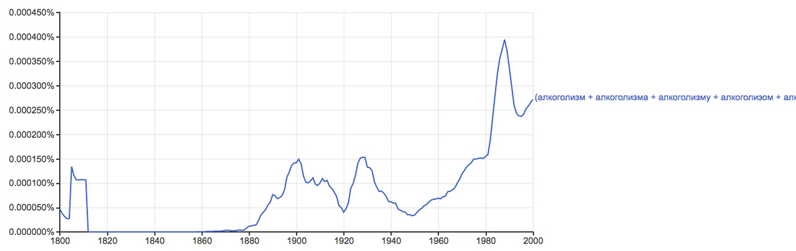
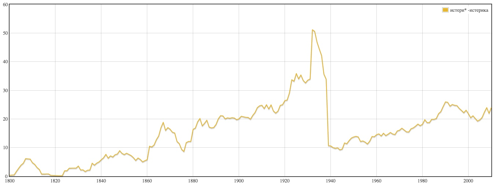
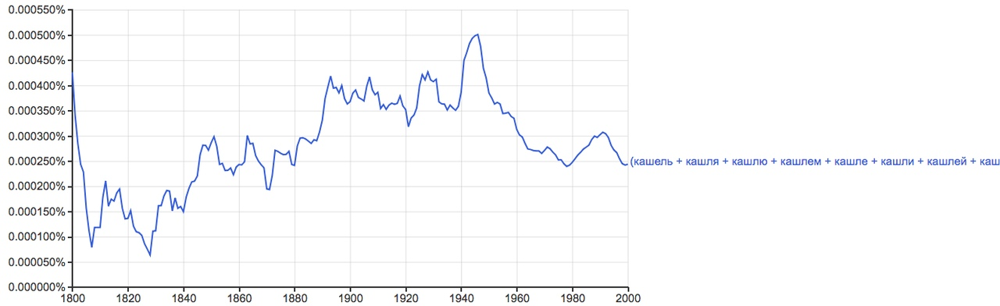
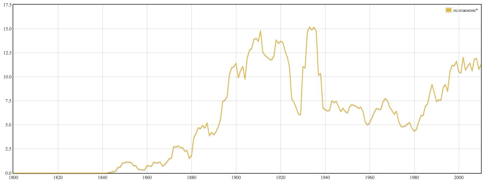
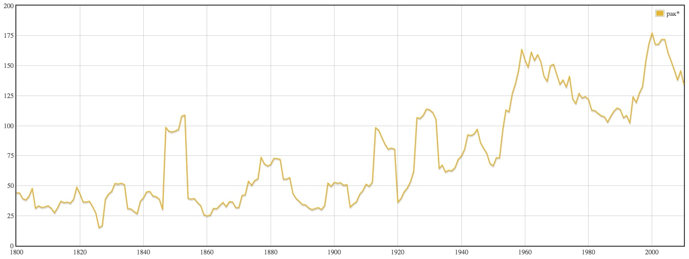
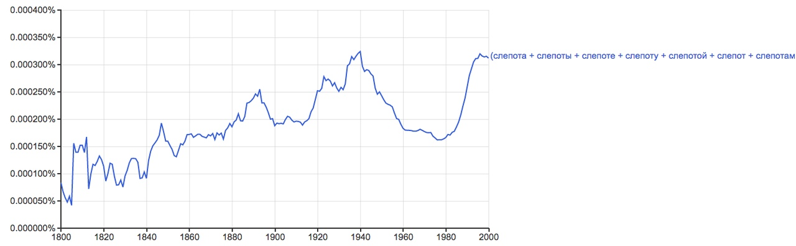
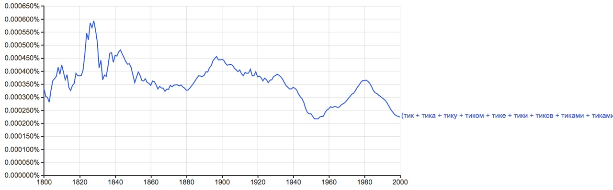
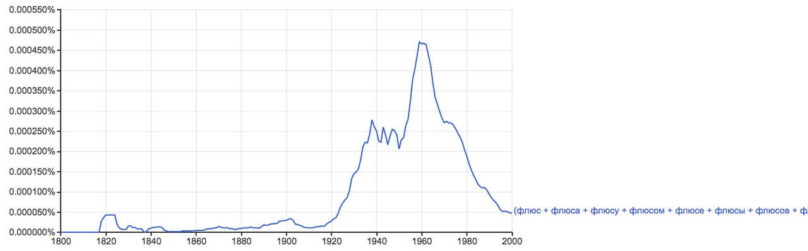

# «Медицинские термины в рассказах Чехова»

| **Cлово** | **Количество вхождений** |**ipm** |
|------|:----:|-----|
| болезнь | 80 | 198,438 |
| подагра |  6  | 14,883 |
| язва |  4 |  9,922 |
| тиф  | 8  | 19,844 |
| рак |  25  |  62,012 |
| простуда |  4 |  9,922 |
| мигрень  |  8 |  19,844 |
| чахотка |  11 |  27,285 |
| флюс  |  1 |  2,480 |
| ревматизм |  7 |  17,363 |
| расстройство |  3 |  7,441 |
| осложнение  | 2 |  4,961 |
| лихорадка  | 6 |  14,883 |
| кашель | 18  | 44,648 |
| истерия  | 1 |  2,480 |
| безумие |  2 |  4,961 |
| холера |  15 |  37,207 |
| проказа |  1 |  2,480 |
| золотуха |  1 |  2,480 |
| бессонница |  4 |  9,922 |
| астма|   1 |  2,480 |
| алкоголизм |  2 |  4,961 |
| желтуха |  2 |  4,961 |
| психоз |  1  | 2,480 |
| мания |  1 |  2,480 |
| идиотизм |  1 |  2,480 |
| бешенство |  3 |  7,441 |
| дифтерит |  9 |  22,324 |
| эпидемия |  5 |  12,402 |
| анемия |  1 |  2,480 |
| оспа |  8 |  19,844 |
| катар |  3 |  7,441 |
| чесотка |  1 |  2,480 |  
| психопатия |  1 |  2,480 |
| плеврит |  1 |  2,480 |
| невралгия |  1 |  2,480 | 
| скарлатина |  1 |  2,480 |
| насморк |  2 |  4,491 |
| веснянка |  2 |  4,491 |
| дизентерия |  1 |  2,480 | 
| диабет |  1 |  2,480 |
| тик  | 6 |  14,883 |
| сердцебиение |  8 |  19,844 |
| озноб |  3 |  7,441 |
| роды |  2 |  4,961 |
| пульс |  4 |  9.922 |
| запор |  1 |  2,480 |
| атавизм |  2 |  4,961 |
| кровообращение |  2 |  4,961 |
| конституция |  1 |  2,480 |
| беременность |  2 |   4,961 |
| судорога |  2  |  4,961 |
| физиология |  1 |  2,480 | 
| слепота |  1 |  2,480 |
| схватки |  1 |  2,480 |
| диагностика |  3 |  7,441 |
| **ВСЕГО**|   412 | 1021,955 |

# Графики
 | **НКРЯ** | **Google Ngrams** |
|------|------|
 |  |  |
 |  |  | | 
 |  |  | |
 |    |  | |
  |    |  | |
  |    |  | 
  |    |  | 
  |   |  | 
  |   |  |  
  |    |  | 
  |  |  | 
  |  |  | 
  |  |  | 
  |  |  | 
  |   |  | 
  |    |  | 
  |  |  | 
  |  |  | 
  |  |  | 
  |  |  | 
  |  |  | 
  |  |  | 
  |  |  | 
  |  |  | 
  |  |  | 
  |  |  | 
  |  |  | 
  |  |  | 
  |  |  | 
  |  |  | 
  |  |  | 
  |  |  | 
  |  |  | 
  |  |  | 
  |  |  | 
  |  |  | 
  |  |  | 
  |  |  | 
  |  |  | 
  |  |  | 
  |  |  | 
  |  |  | 
  |  |  | 
  |  |  | 
  |  |  | 
  |  |  | 
  |  |  | 
  |  |  | 
  |  |  | 
  |  |  | 
  |  |  | 
  |  |  | 
  |  |  | 
  |  |  | 
  |  |  | 
  |  |  | 

# Топ-5 медицинских терминов

# Конкорданс 5 самых употребимых терминов

